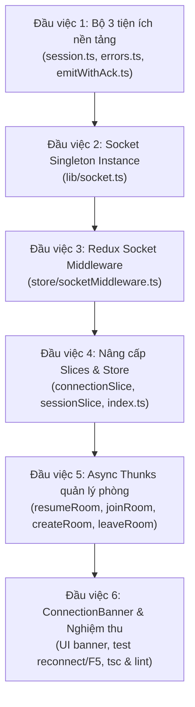

# 🚀 Kế hoạch triển khai Giai đoạn 1: Hạ tầng Socket, Redux và Session

> **Nguồn tài liệu:** [food-guess-docs.md](file:///d:/project/Food-guess/docs/food-guess-docs.md) (Mục 2, 5, 6, 7, 8) và [food-guess-fe-plan.md](file:///d:/project/Food-guess/docs/food-guess-fe-plan.md) (Giai đoạn 1).  
> **Mục tiêu:** Xây dựng hạ tầng kết nối realtime tin cậy, không phụ thuộc vào vòng đời component React. Đảm bảo người chơi **F5 giữa ván vẫn giữ nguyên ván chơi không mất tên/điểm**, **mất mạng tự reconnect và resume phiên**, và **không bị nhận snapshot trùng lặp trong React Strict Mode**.

---

## 📌 Hiện trạng dự án sau Giai đoạn 0

- [x] Dự án Next.js 16 (Turbopack) + TypeScript 5 + Tailwind CSS 4 đã hoạt động ổn định.
- [x] Redux Toolkit store + typed hooks + `StoreProvider` (lazy `useState` chuẩn React 19) sẵn sàng.
- [x] Toàn bộ TypeScript contracts từ BE (`RoomSnapshot`, `Ack<T>`, `ChatMessage`, `StoredParticipant`...) tại [`src/types/`](file:///d:/project/Food-guess/src/types).
- [x] Component hiển thị ảnh [`FoodImage.tsx`](file:///d:/project/Food-guess/src/components/shared/FoodImage.tsx) với skeleton & fallback.
- [x] Dữ liệu mock 4 phase và route [`/dev/preview`](file:///d:/project/Food-guess/src/app/dev/preview/page.tsx).
- [x] Kiểm tra chất lượng: `tsc`, `lint`, `build` đều **✅ 0 errors, 0 warnings**.

---

## 🎯 6 Đầu việc cụ thể của Giai đoạn 1

---

### 1. Đầu việc 1: Bộ ba tiện ích nền tảng (`src/lib/`)

| File | Trách nhiệm | Chi tiết kỹ thuật |
|---|---|---|
| [`src/lib/session.ts`](file:///d:/project/Food-guess/src/lib/session.ts) | Quản lý storage phiên chơi | - Key: `room_participant_{code}` - Type: `StoredParticipant = { participantId, token, name }` - Các hàm: `getStoredParticipant(code)`, `setStoredParticipant(code, data)`, `clearStoredParticipant(code)` - **Bảo vệ SSR:** Kiểm tra `typeof window !== "undefined"` tránh lỗi Hydration. |
| [`src/lib/errors.ts`](file:///d:/project/Food-guess/src/lib/errors.ts) | Từ điển mã lỗi tiếng Việt | - Map 12 mã lỗi từ Mục 7: `ROOM_NOT_FOUND`, `ROOM_FULL`, `NAME_TAKEN`, `RESUME_DENIED`, `INVALID_PAYLOAD`, `INVALID_PHASE`, `ROUND_MISMATCH`, `TOO_LATE`, `ALREADY_ANSWERED`, `HOST_ONLY`, `NOT_IN_ROOM`, `RATE_LIMITED`, `INVALID_GIF_URL`. - Hàm `getErrorMessage(errorCode?: string): string` có fallback văn bản an toàn. |
| [`src/lib/emitWithAck.ts`](file:///d:/project/Food-guess/src/lib/emitWithAck.ts) | Wrapper Promise cho Socket Emit | - Bọc `socket.emit(event, payload, callback)` thành Promise trả về `Promise<T>`. - Timeout mặc định: 10.000ms (10 giây) để tránh treo UI khi rớt mạng. - Nếu `ack.ok === false` ➔ reject với Error chứa mã lỗi tương ứng. |

---

### 2. Đầu việc 2: Socket Singleton Instance (`src/lib/socket.ts`)

| File | Trách nhiệm | Chi tiết kỹ thuật |
|---|---|---|
| [`src/lib/socket.ts`](file:///d:/project/Food-guess/src/lib/socket.ts) | Singleton Socket.IO Client | - Cấu hình theo Mục 2.1 & 8.1 của tài liệu:   + `io(API_URL, { ... })`: URL tường minh trỏ tới `https://uwu-cup.onrender.com`.   + `path: "/socket.io"`   + `transports: ["websocket", "polling"]`   + `reconnection: true`, `reconnectionAttempts: 10`, `reconnectionDelay: 1000`   + `autoConnect: false`: Không tự động kết nối khi import, chỉ kết nối khi Redux store/thunk kích hoạt.   + `timeout: 30000`: Timeout 30 giây hỗ trợ cold start của Render. |

---

### 3. Đầu việc 3: Redux Socket Middleware (`src/store/socketMiddleware.ts`)

> [!IMPORTANT]
> **Nguyên tắc cốt lõi (Mục 2.1 của Plan):** Listener Socket chỉ được đăng ký **duy nhất một lần** trong Redux middleware. Không đăng ký trong `useEffect` của React Component vì ở môi trường dev (React Strict Mode mount 2 lần) sẽ gây trùng lặp listener và nhân đôi `room:snapshot`.

- Khởi tạo listener một lần duy nhất với cờ `isInitialized`:
  - `connect` ➔ dispatch `connectionSlice.actions.connected({ socketId: socket.id })`
  - `disconnect` ➔ dispatch `connectionSlice.actions.disconnected({ reason })`
  - `connect_error` ➔ dispatch `connectionSlice.actions.connectError({ message: err.message })`
  - `reconnect_attempt` ➔ dispatch `connectionSlice.actions.reconnecting({ attempt })`
  - `room:snapshot` ➔ dispatch `roomSlice.actions.setSnapshot(snapshot)`
  - `chat:message` ➔ dispatch `chatSlice.actions.addMessage(message)`

---

### 4. Đầu việc 4: Nâng cấp Redux Slices & Gắn Middleware vào Store

| File | Thay đổi chính |
|---|---|
| [`src/store/slices/connectionSlice.ts`](file:///d:/project/Food-guess/src/store/slices/connectionSlice.ts) | - Trạng thái: `idle` \| `connecting` \| `waking` (server đang tỉnh giấc sau cold start) \| `connected` \| `reconnecting` \| `error`. - Lưu trữ `socketId: string \| null`, `reconnectAttempt: number`. - Action: `setWaking()`, `setConnecting()`, `connected()`, `disconnected()`, `reconnecting()`, `connectError()`. |
| [`src/store/slices/sessionSlice.ts`](file:///d:/project/Food-guess/src/store/slices/sessionSlice.ts) | - Trạng thái: `idle` \| `resuming` \| `needsName` \| `joining` \| `joined`. - Lưu trữ `currentRoomCode: string \| null`, `storedParticipant: StoredParticipant \| null`. - Action: `setResuming()`, `setNeedsName()`, `setJoining()`, `setJoined()`, `clearSession()`. |
| [`src/store/slices/roomSlice.ts`](file:///d:/project/Food-guess/src/store/slices/roomSlice.ts) | - `setSnapshot(snapshot)`: Thay thế toàn bộ snapshot nguyên khối (không merge cục bộ). - `clearRoom()`: Xóa dữ liệu khi người chơi rời phòng. |
| [`src/store/index.ts`](file:///d:/project/Food-guess/src/store/index.ts) | - Gắn `socketMiddleware` vào mảng middleware của Redux trong hàm `makeStore()`. |

---

### 5. Đầu việc 5: Async Thunks Quản lý Phòng & Phiên (`src/store/thunks/roomThunks.ts`)

| Thunk | Quy trình thực thi nghiệp vụ |
|---|---|
| `resumeRoom({ code })` | 1. Đọc storage qua `getStoredParticipant(code)`. 2. Nếu **CÓ**: dispatch `setResuming()`, gọi `emitWithAck("room:resume", { code, participantId, token })`.    - Nếu thành công: dispatch `setJoined()`, cập nhật snapshot.    - Nếu lỗi (`RESUME_DENIED` hoặc `ROOM_NOT_FOUND`): gọi `clearStoredParticipant(code)`, dispatch `setNeedsName()`. 3. Nếu **KHÔNG**: dispatch `setNeedsName()`. |
| `joinRoom({ code, name })` | 1. dispatch `setJoining()`. 2. Gọi `emitWithAck("room:join", { code, name })`. 3. Nhận ack `{ participantId, token }` ➔ gọi `setStoredParticipant(code, { participantId, token, name })`. 4. dispatch `setJoined()`. |
| `createRoom({ config, name })` | 1. dispatch `setJoining()`. 2. Gọi `emitWithAck("room:create", { config, name })`. 3. Nhận ack `{ code, participantId, token }` ➔ gọi `setStoredParticipant(code, { participantId, token, name })`. 4. dispatch `setJoined()`. |
| `leaveRoom({ code })` | 1. Gọi `emitWithAck("room:leave", { code })`. 2. Gọi `clearStoredParticipant(code)`. 3. dispatch `clearSession()` và `clearRoom()`. |

---

### 6. Đầu việc 6: Component `ConnectionBanner` & Nghiệm thu Tích hợp

| File | Nội dung thực hiện |
|---|---|
| [`src/components/room/ConnectionBanner.tsx`](file:///d:/project/Food-guess/src/components/room/ConnectionBanner.tsx) | - Banner cảnh báo thông minh tự động xuất hiện ở đầu trang khi trạng thái kết nối khác `connected`:   + `waking`: "Đang đánh thức server (Cold start), vui lòng đợi giây lát..." (hiệu ứng pulse)   + `reconnecting`: "Mất kết nối. Đang thử kết nối lại (lần x/10)..."   + `error`: "Không thể kết nối tới server" kèm nút bấm "Thử lại". |
| [`src/app/dev/preview/page.tsx`](file:///d:/project/Food-guess/src/app/dev/preview/page.tsx) | - Bổ sung khối kiểm thử Socket & Session thực tế vào trang Preview:   + Nút bấm: "Connect Socket", "Disconnect", "Test Resume Session".   + Trực quan hóa trạng thái `connection.status` và `session.status`. |
| **Kiểm tra chất lượng** | - Chạy `npx tsc --noEmit` ➔ 0 lỗi. - Chạy `npm run lint` ➔ 0 warnings, 0 errors. - Chạy `npm run build` ➔ build production thành công. |

---

## 📋 Tiêu chuẩn nghiệm thu (Definition of Done) Giai đoạn 1

- [x] Toàn bộ 6 đầu việc được thực hiện lần lượt, xác nhận từng đầu việc trước khi sang đầu việc tiếp theo.
- [x] TypeScript compile: 0 lỗi (`npx tsc --noEmit`).
- [x] ESLint: 0 warnings, 0 errors (`npm run lint`).
- [x] Không có lỗi runtime hydration mismatch hay access `useRef` trong render.
- [x] Kết nối handshake và nhận snapshot thành công từ backend server Render.
- [x] F5 reload trang trong trạng thái có session vẫn khôi phục đúng ván chơi mà không phải nhập lại tên.
