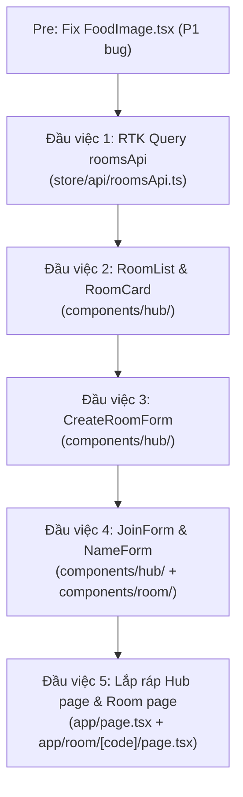

# 🚀 Kế hoạch triển khai Giai đoạn 2: Hub, Tạo phòng và Vào phòng

> **Ngày lập kế hoạch:** 06/10/2026  
> **Nguồn tài liệu:**
> - [`food-guess-docs.md`](./food-guess-docs.md) — Mục 3 (GET /api/rooms), 5.2.1-3 (create/join/resume)  
> - [`food-guess-fe-plan.md`](./food-guess-fe-plan.md) — Giai đoạn 2  
> **Tiền đề:** Giai đoạn 0 & 1 hoàn thành 100% (audit 06/10/2026)  
> **Ưu tiên trước khi bắt đầu:** Fix bug P1 `FoodImage.tsx` (thiếu reset state khi `src` đổi)

---

## 📌 Hiện trạng cần kế thừa

| File | Trạng thái | Ghi chú |
|---|:---:|---|
| `store/api/index.ts` | ✅ Hoàn thành | Re-export roomsApi & helper types/functions |
| `store/api/roomsApi.ts` | ✅ Hoàn thành | RTK Query endpoint GET /api/rooms + filter/categorize helpers |
| `store/index.ts` | ✅ Sẵn sàng | Đã thêm roomsApi.reducer và roomsApi.middleware |
| `components/shared/FoodImage.tsx` | ✅ Đã fix | Reset state an toàn khi `src` thay đổi |
| `components/hub/index.ts` | ✅ Hoàn thành | Export RoomCard, RoomList, CreateRoomForm, JoinForm |
| `components/room/index.ts` | ✅ Hoàn thành | Export ConnectionBanner, NameForm |
| `app/page.tsx` | ✅ Hoàn thành | Hub page 2 cột hoàn chỉnh (Đầu việc 5) |
| `app/room/[code]/page.tsx` | ✅ Hoàn thành | Room dynamic page tự động resume/nhập tên (Đầu việc 5) |
| `store/thunks/roomThunks.ts` | ✅ Hoàn chỉnh | `createRoom`, `joinRoom`, `leaveRoom` đã có |
| `lib/socket.ts` | ✅ Sẵn sàng | Singleton đã cấu hình |

---

## 🎯 Mục tiêu Giai đoạn 2

Sau giai đoạn này, người dùng có thể:
1. Xem danh sách phòng `food-guess` đang mở (tự cập nhật mỗi 5s)
2. Tạo phòng mới với cấu hình tuỳ chỉnh → điều hướng vào `/room/{code}`
3. Vào phòng bằng mã → điều hướng vào `/room/{code}`
4. Truy cập link trực tiếp `/room/{code}` → hiện form nhập tên nếu chưa có session

---

## 🔧 Việc fix cần làm trước (Pre-phase)

### Fix P1: `FoodImage.tsx` — Reset state khi `src` đổi

```typescript
// src/components/shared/FoodImage.tsx
// Thêm useEffect reset isLoading/hasError mỗi khi src thay đổi
import { useState, useCallback, useEffect } from "react";

// Trong component body, sau khai báo state:
useEffect(() => {
  setIsLoading(true);
  setHasError(false);
}, [src]);
```

---

## 📋 5 Đầu việc Giai đoạn 2



---

## Đầu việc 1: RTK Query `roomsApi` ✅ (Đã hoàn thành)

**File:** `src/store/api/roomsApi.ts`

### Yêu cầu kỹ thuật

| Mục | Chi tiết |
|---|---|
| Endpoint | `GET {API_URL}/api/rooms` |
| Polling | `pollingInterval: 5000` (5 giây) |
| Dừng khi unfocused | `skipPollingIfUnfocused: true` |
| Cache | `keepUnusedDataFor: 0` (không giữ cache) |
| Filter | FE tự filter `gameType === "food-guess"` |
| Refresh thủ công | Expose `refetch` từ hook |

### Selector computed cần tạo (trong file hoặc `selectors.ts`)

```typescript
// Từ danh sách gốc, tính 3 nhóm:
const foodGuessRooms = rooms.filter(r => r.gameType === "food-guess");

// Phân loại hiển thị:
// - joinableRooms: phase "lobby" hoặc "playing", participantCount < 50
// - fullRooms: participantCount >= 50
// - finishedRooms: phase "finished"
```

### Tích hợp vào Store

`store/index.ts` cần:
1. Import `roomsApi`
2. Thêm `roomsApi.reducer` vào `reducer` object
3. Thêm `roomsApi.middleware` vào `middleware` chain

---

## Đầu việc 2: Hub Components — `RoomList` & `RoomCard` ✅ (Đã hoàn thành)

**Thư mục:** `src/components/hub/`

### `RoomCard.tsx`
Hiển thị một phòng trong danh sách.

| Prop | Type | Hiển thị |
|---|---|---|
| `room` | `RoomSummary` | — |
| `onJoin` | `(code: string) => void` | — |

**Nội dung render:**
- Badge trạng thái: `lobby` (🟢 Đang chờ) / `playing` (🟡 Đang chơi) / `finished` (⚫ Kết thúc)
- Mã phòng + tên host
- Số người: `participantCount / 50` (thanh progress nhỏ)
- `onlineCount` badge online
- Nút **"Vào chơi"**: disabled khi `participantCount >= 50` hoặc `phase === "finished"`
- Label "ĐẦYMM" khi `participantCount >= 50`

### `RoomList.tsx`
Container quản lý danh sách + polling.

**Logic:**
- Gọi `useGetRoomsQuery(undefined, { pollingInterval: 5000, skipPollingIfUnfocused: true })`
- Filter `gameType === "food-guess"` trên dữ liệu nhận được
- State: `isLoading` → skeleton cards (3-4 skeleton), `error` → nút retry, `data.length === 0` → empty state
- Nút **"Làm mới"** gọi `refetch()`
- Timestamp "Cập nhật lúc HH:MM:SS" sau mỗi lần fetch thành công

**Skeleton card:** Animate pulse, giữ layout giống `RoomCard` thật.

---

## Đầu việc 3: `CreateRoomForm` ✅ (Đã hoàn thành)

**File:** `src/components/hub/CreateRoomForm.tsx`

### Fields & Validation

| Field | Kiểu | Giới hạn | Mặc định |
|---|---|---|---|
| `name` | text input | 2–24 ký tự | `""` |
| `totalRounds` | number / slider | 5–50 | `10` |
| `answerTimeSeconds` | number / slider | 10–120 | `30` |
| `autoNextRound` | toggle switch | boolean | `true` |
| `comboStreakEnabled` | toggle switch | boolean | `true` |

### Config cứng

```typescript
const config: FoodGuessConfig = {
  gameType: "food-guess", // luôn cố định
  totalRounds,
  answerTimeSeconds,
  autoNextRound,
  comboStreakEnabled,
};
```

### Luồng submit

```
User bấm "Tạo phòng"
  → validate (tên 2-24 ký tự, số trong range)
  → Nếu socket chưa connect: dispatch(connectSocketAction()) + chờ
  → dispatch(createRoom({ config, name }))
    ← thunk: setJoining → room:create → setStoredParticipant → setJoined + setSnapshot
  → Khi sessionSlice.status === "joined": router.push(`/room/${roomCode}`)
  → Nếu rejected: hiện toast lỗi (dùng getErrorMessage)
```

### UI States

- **Idle:** Form đầy đủ fields + nút "Tạo phòng"
- **Joining:** Button loading spinner + disabled form
- **Error:** Toast lỗi, form trở lại để retry

---

## Đầu việc 4: `JoinForm` & `NameForm` ✅ (Đã hoàn thành)

### `JoinForm.tsx` — Vào phòng từ Hub (nhập mã + tên)

**File:** `src/components/hub/JoinForm.tsx`

**Fields:**
- `code`: text input, uppercase 6 ký tự (A-Z, 2-9), auto-uppercase khi gõ
- `name`: text input, 2–24 ký tự

**Luồng submit:**
```
dispatch(connectSocketAction()) nếu chưa connect
→ dispatch(joinRoom({ code: code.toUpperCase(), name }))
  ← thunk: setJoining → room:join → setStoredParticipant → setJoined + setSnapshot
→ sessionSlice.status === "joined": router.push(`/room/${code}`)
→ rejected: toast lỗi (NAME_TAKEN, ROOM_NOT_FOUND, ROOM_FULL...)
```

### `NameForm.tsx` — Vào phòng khi truy cập link trực tiếp

**File:** `src/components/room/NameForm.tsx`

Dùng khi vào `/room/{code}` mà `sessionSlice.status === "needsName"`.

**Field:** Chỉ `name` (2–24 ký tự) — `code` đã có từ URL.

**Luồng:**
```
dispatch(joinRoom({ code, name }))
→ thunk tự xử lý setJoined + setSnapshot
→ RoomPage re-render theo snapshot phase
```

**Không redirect** — RoomPage sẽ chuyển view tự động khi `sessionSlice.status` đổi sang `"joined"`.

---

## Đầu việc 5: Lắp ráp Hub page & Room page ✅ (Đã hoàn thành)

### `app/page.tsx` — Hub page hoàn chỉnh

**Layout (mobile-first):**
```
┌─────────────────────────────┐
│  Navbar (sticky)            │
├─────────────────────────────┤
│  Hero: tiêu đề + 2 CTA      │
│  [Tạo phòng] [Nhập mã]      │
├─────────────────────────────┤
│  CreateRoomForm (collapsible│
│  hoặc modal/drawer)         │
├─────────────────────────────┤
│  JoinForm (inline compact)  │
├─────────────────────────────┤
│  RoomList (tự cập nhật 5s)  │
│  [Skeleton / Cards / Empty] │
└─────────────────────────────┘
```

**Quyết định thiết kế:** `CreateRoomForm` mở trong accordion/section toggleable để không chiếm quá nhiều viewport.

**Đổi Hub page từ Server Component → Client Component** (`"use client"`) vì cần:
- `useRouter` (điều hướng sau join/create)
- `useAppDispatch` / `useAppSelector` (Redux)
- RTK Query hooks

### `app/room/[code]/page.tsx` — Room page hoàn chỉnh

**Logic routing theo sessionSlice.status:**

```typescript
// Khi component mount:
useEffect(() => {
  if (!socket.connected) dispatch(connectSocketAction());
  dispatch(resumeRoom({ code }));
}, [code]);

// Render theo trạng thái:
switch (sessionStatus) {
  case "resuming":  return <ResumingScreen />;        // Spinner "Đang khôi phục..."
  case "needsName": return <NameForm code={code} />;  // Form nhập tên
  case "joining":   return <JoiningScreen />;         // Spinner "Đang vào phòng..."
  case "joined":    return <RoomView />;              // 4 phase views (GĐ 3-5)
  default:          return <ResumingScreen />;
}
```

**`RoomView`** (placeholder cho GĐ 3-5):
```typescript
// Dựa vào snapshot.phase để chọn view:
switch (phase) {
  case "lobby":       return <LobbyView />;      // GĐ 3
  case "playing":     return <PlayingView />;    // GĐ 4
  case "roundReveal": return <RevealView />;     // GĐ 5
  case "finished":    return <FinishedView />;   // GĐ 5
}
```

---

## ⚠️ Các điểm cần chú ý kỹ

### 1. Socket connect trước khi emit

`createRoom` và `joinRoom` thunk cần socket đã connected. Thứ tự:
1. Kiểm tra `socket.connected`
2. Nếu chưa: dispatch `connectSocketAction()` và **không await** — thunk tự emit sau khi `connect` event nổ ra? ❌ Không đúng.

**Giải pháp đúng:**
- Hub page dispatch `connectSocketAction()` khi **mount** (không phải khi user submit)
- Nếu `connectionStatus !== "connected"` khi user submit → show message "Đang kết nối, vui lòng đợi..." thay vì disable toàn bộ form
- Hoặc: `createRoom`/`joinRoom` thunk tự gọi `socket.connect()` nếu chưa connect trước khi emit

### 2. `connectSocketAction` vs `socket.connect()` trực tiếp

Luôn dùng `dispatch(connectSocketAction())` — không gọi `socket.connect()` trực tiếp trong component. Đúng với nguyên tắc Plan mục 2.1.

### 3. Polling và tab focus

RTK Query tự dừng polling khi tab mất focus (`skipPollingIfUnfocused: true`) — không cần `visibilitychange` listener thủ công.

### 4. `createRoom` không có roomCode khi đang joining

`sessionSlice.roomCode` sẽ là `""` trong khi đang creating. Sau khi `setJoined` thành công, `roomCode` mới có giá trị đúng. Component phải đọc `roomCode` **sau khi** `status === "joined"`.

### 5. Server cold start và UX

Hub mount → dispatch `connectSocketAction()` → socket `waking` → `ConnectionBanner` hiện tự động. Polling RTK Query chạy song song.  
**Không block UX:** Người dùng vẫn thấy danh sách phòng (từ cache) và form trong khi socket đang kết nối.

### 6. Validate form phía client

- `name`: trim → check length 2-24
- `code`: trim → toUpperCase → check 6 ký tự alphanumeric
- `totalRounds`: parseInt → clamp 5-50
- `answerTimeSeconds`: parseInt → clamp 10-120
- **Không gọi dispatch nếu validate fail** — chỉ show inline error message

---

## 📊 Bảng file cần tạo/sửa

| File | Hành động | Ghi chú |
|---|:---:|---|
| `src/components/shared/FoodImage.tsx` | ✏️ Sửa | Fix P1: thêm `useEffect` reset state |
| `src/store/api/roomsApi.ts` | 🆕 Tạo | RTK Query, polling 5s |
| `src/store/index.ts` | ✏️ Sửa | Thêm `roomsApi` reducer + middleware |
| `src/components/hub/RoomCard.tsx` | 🆕 Tạo | — |
| `src/components/hub/RoomList.tsx` | 🆕 Tạo | Dùng RTK Query hook |
| `src/components/hub/CreateRoomForm.tsx` | 🆕 Tạo | — |
| `src/components/hub/JoinForm.tsx` | 🆕 Tạo | — |
| `src/components/hub/index.ts` | ✏️ Sửa | Export 4 components mới |
| `src/components/room/NameForm.tsx` | 🆕 Tạo | — |
| `src/components/room/index.ts` | ✏️ Sửa | Export `NameForm` |
| `src/app/page.tsx` | ✏️ Sửa toàn bộ | Đổi thành Client Component, lắp Hub |
| `src/app/room/[code]/page.tsx` | ✏️ Sửa toàn bộ | Thêm mount logic, routing theo status |

---

## 📋 Tiêu chuẩn nghiệm thu (Definition of Done)

- [ ] `tsc --noEmit` → 0 lỗi
- [ ] `npm run lint` → 0 warnings, 0 errors
- [ ] Tạo phòng → điều hướng đúng `/room/{code}` → F5 → resume tự động (không hỏi lại tên)
- [ ] Vào phòng bằng mã từ Hub → điều hướng đúng
- [ ] Truy cập `/room/{code}` trực tiếp chưa có session → hiện `NameForm`
- [ ] Danh sách phòng tự cập nhật mỗi 5s, dừng khi tab mất focus
- [ ] Nút làm mới danh sách hoạt động
- [ ] `NAME_TAKEN`, `ROOM_FULL`, `ROOM_NOT_FOUND` → toast lỗi đúng
- [ ] Form tạo phòng validate đủ 5 fields (name 2-24, totalRounds 5-50, answerTimeSeconds 10-120)
- [ ] Responsive mobile (form có thể nhập thoải mái, keyboard không che nút submit)
- [ ] `ConnectionBanner` hiện đúng khi đang `waking`/`reconnecting`/`error`
